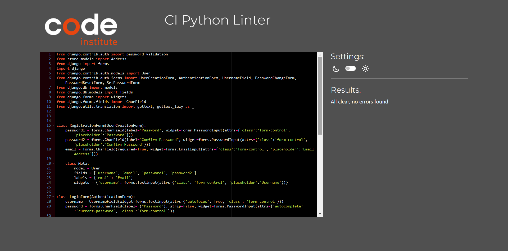

# Table of Contents
 * [Validator Testing](#Validator-Testing "Validator Testing")
   * [HTML](#HTML "Html")
   * [CSS](#Css "Css")
   * [PYTHON](#Python "Python")
   * [LIGHTHOUSE](#LIGHTHOUSE "LIGHTHOUSE")
   * [GTMETRIX](#GTMETRIX "GTMETRIX")
   

 * [Device Testing](#Device-Testing "Device Testing")
 * [Manual Testing](#Manual-Testing "Manual Testing")
 * [Unfixed Bugs](#Unfixed-Bugs "Unfixed Bugs")

# Validator Testing

Click to see more

  ## HTML Validator

  * Home Page
    
  * Category Page
    
  * Cart Page
    
  * Profile Page
    
  * Order Page
    
  * Log In
    
  * Sign-Up Page
    

### Note
  - W3's never validate because its browser specific. W3's validators validate based on the official standards. Things that other browsers add in will always be flagged.

 ## CSS Validator

  * CSS
   

### Note
  - Probably gets flagged because its outdated but you need it for older browsers. Vendor prefixes increase compatibility with older browsers.

## Python

 - Store folder 
 All available files have been checked
  * form.py
  
  * model.py
  
  * url.py
  
 
 - Phones Store
    * url.py
    
   
## Note
 -  Most of the issues where about the number of line is 2 long,this should be > 79 characters.

## Lighthouse

Click to see more

 * Home Page
     * Desktop
  
     * Mobile
  
 
 * Categories
    * Desktop
  
    * Mobile
  
   
  * About 
    * Desktop
 
     * Mobile
 

  * Contact Page 
     * Desktop
  
     * Mobile
  
  
  * Cart Page
 * Desktop
  
    * Mobile
  
  
  * Profile
  * Desktop
  
    * Mobile
  

   * Orders
 * Desktop
  
    * Mobile
  

   * Change Password Page
  * Desktop
  
    * Mobile
  

   * SignUp Page 
    * Desktop
  
    * Mobile
  

  * LogIn Page
 * Desktop
  
    * Mobile
  

  

   ## GTMETRIX 
   

  

    # Device Testing
     ***

     The project has been checked on these devices :
       
    * iMac 
    * iPad Apple
    * MacBook Pro
    * Samsung Galaxy Tablet
    * Iphone 6
    * Iphone 11
    * Chrome
    * Firefox
    
    On all these devices the project worked perfectly, and no errors were detected.

   # Manual Testing

Click to see more

(1)

| Feature       |           Test Performed    |             Result           |        
|:--------------|:--------------------------- |:---------------------------  |
|                        Navigation                                        |
| Logo          | Clicked on Logo to check or redirect to the home page| Pass |
| Home button   | Clicked on the Home button from different pages to check or redirect to the home page| Pass  | 
| Categories   | Clicked on the categories and was redirected to the categories section | Pass |
| Sign-Up     | When clicking on the Sign-Up link, brings the User to the registration page | Pass |
| Small screens |  Checked that on smaller devices changes to the burger menu | Pass |
| About US      | Clicked About US and was redirected to the page with brief info on the | Pass | 
| Log In        | Clicked on the log-in link that will bring the User to the login page  | Pass |
| Log Out       | Clicked on the log-out link that will bring the User to log out page | Pass |
|                                                         Footer                      |
| Small screens |       Checked that all media links are visible on small devices | Pass |                                |
| Media  Links  | Clicked on each media link opens a new page   | Pass |
| Footer is on all pages      | Check all pages how the footer looks   | Pass |

(2)

| Feature       |           Test Performed    |             Result           |        
|:--------------|:--------------------------- |:---------------------------  |
|                        Categories                                      |
| Categories Page      | For this test, I want to make sure that when you clicked the full menu of all categories.| Pass |
| All Categories Button   | For this test, I want to make sure that when you clicked the full menu of all categories.| Pass  | 
| Sub-Category Overview  | For this test, I want to make sure that when you click the product ,it open up an overview of all the different products in that sub-Category.  | Pass |
| Products    | For this test, I want to make sure that when you click on a product,you are redirected to a Products Overview. | Pass |
| Products Overview|  For this test, I have a clear overview of all details of the product with descriptions,ratings and add-cart button. | Pass |
| View form on different sizes of devices | Check how will look categories form on tablets and phones, make sure all form fields are easy to see and use | Pass | 
| Log In        | Clicked on the log-in link that will bring the User to the login page  | Pass |
| Log Out       | Clicked on the log-out link that will bring the User to log out page | Pass |
|                                                         Footer                      |
| Small screens |       Checked that all media links are visible on small devices | Pass |                                |
| Media  Links  | Clicked on each media link opens a new page   | Pass |
| Footer is on all pages      | Check all pages how the footer looks   | Pass |

(3)

| Feature       |           Test Performed    |             Result           |        
|:--------------|:--------------------------- |:---------------------------  |
|                    About US Page                                   |
| About US   | For this test, I want to make sure that when you clicked the About link.| Pass |
| View form on different sizes of devices | Check how will look about Us form on tablets and phones, make sure all form fields are easy to see and use | Pass | 
| Log In        | Clicked on the log-in link that will bring the User to the login page  | Pass |
| Log Out       | Clicked on the log-out link that will bring the User to log out page | Pass |
|                                                         Footer                      |
| Small screens |       Checked that all media links are visible on small devices | Pass |                                |
| Media  Links  | Clicked on each media link opens a new page   | Pass |
| Footer is on all pages      | Check all pages how the footer looks   | Pass |

(4)

| Feature       |           Test Performed    |             Result           |        
|:--------------|:--------------------------- |:---------------------------  |
|                         Contact  Page                     |
| Contact Page| For this test, I want to make sure that when you clicked the Contact link.|Pass |
| Save Contact | I filled out all the fields and Contact was successfully. | Pass|
| View form on different sizes of devices | Check how will look contact form on tablets and phones, make sure all form fields are easy to see and use| Pass. |
| Log In        | Clicked on the log-in link that will bring the User to the login page  | Pass |
| Log Out       | Clicked on the log-out link that will bring the User to log out page | Pass |
|                                                         Footer                      |
| Small screens |       Checked that all media links are visible on small devices | Pass |                                |
| Media  Links  | Clicked on each media link opens a new page   | Pass |
| Footer is on all pages      | Check all pages how the footer looks   | Pass |

(5)

| Feature       |           Test Performed    |             Result           |        
|:--------------|:--------------------------- |:---------------------------  |
|                        Cart Page                     |
| Cart Page| For this test, I want to make sure that when you clicked the Cart link.|Pass |
| Shopping Cart| For this test, I want to make sure that when User has added  to the cart from the categories folder they can be able to see,add,delete each order on the cart.|Pass |
| Continue Shipping| For this test, I want to make sure that when you clicked the Continue shipping button under the shopping card the user will be redirected to the Home page.|Pass |
| Cart Total| This section shows the user what selections they have chosen and also shows the shipping address available on file.Also it allow the user to select from variety of shipping address avialable. |Pass |
| Payment Option| For this test, I want to make sure that when you clicked any desired payment option the user can be redirected to a vendor of thier choice to fill out the necessary informations required.|Pass |
| Home button| For this test, I want to make sure that when you clicked the home button is clicked in this section the user is directed to the home page.|Pass |
| View form on different sizes of devices | Check how will look cart form on tablets and phones, make sure all form fields are easy to see and use| Pass. |

(6)

| Feature       |           Test Performed    |             Result           |        
|:--------------|:--------------------------- |:---------------------------  |
|                         Profile Page                     |
| Profile Page| For this test, I want to make sure that when you clicked the Profile link.|Pass |
| Add Address | For this test, I want to make sure that when you clicked on add address they are directed to another Page.|Pass |
| Delete Address| For this test, I want to make sure that when you an address it stays deleted.|Pass |
| Address form| For this test, I want to make sure that when the user has fill his address and all the neccessary area,the changes are able to save and update in the profile page.|Pass |
| View form on different sizes of devices | Check how will look Profile page on tablets and phones, make sure all form fields are easy to see and use| Pass. |

(7)

| Feature       |           Test Performed    |             Result           |        
|:--------------|:--------------------------- |:---------------------------  |
|                         Order Page                     |
| Orders Page| For this test, I want to make sure that when you clicked the Orders link.|Pass |
| Add Address | For this test, I want to make sure that when you clicked on add address they are directed to another Page.|Pass |
| Delete Address| For this test, I want to make sure that when you an address it stays deleted.|Pass |
| Address form| For this test, I want to make sure that when the user has fill his address and all the neccessary area,the changes are able to save and update in the profile page.|Pass |
| View form on different sizes of devices | Check how will look Order page on tablets and phones, make sure all form fields are easy to see and use| Pass. |

(8)

| Feature       |           Test Performed    |             Result           |        
|:--------------|:--------------------------- |:---------------------------  |
|                         Change Password                     |
| Change Password Page| For this test, I want to make sure that when you clicked the Change Password link.|Pass |
| Save Password | I filled out all the fields (Old Password and New Password) and password was successfully saved. | Pass|
| View form on different sizes of devices | Check how will look Change password form on tablets and phones, make sure all form fields are easy to see and use| Pass. |

### Unfixed Bugs
- None so far.
